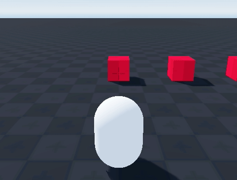

# Object Interaction

Object interaction system. Hovering the crosshair over an object will display text if the object is interactable. Interacting with an object will trigger the interact function on said object.

### Nice to have features

- [ ] Display label for non-interactable objects.
